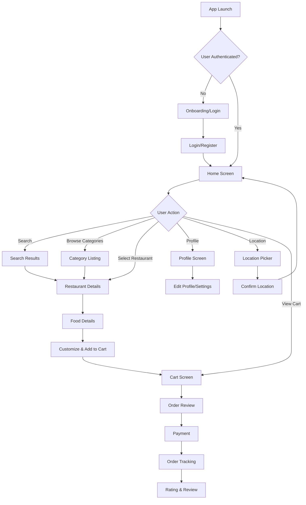

# TastyBuds 🍔 - Food Delivery Android App

[](https://kotlinlang.org)
[](https://android.com)
[](https://developer.android.com/jetpack/compose)
[](https://developer.android.com/studio/releases/gradle-plugin)

A modern, feature-rich food delivery Android application built with Jetpack Compose and following Clean Architecture principles. TastyBuds offers a seamless food ordering experience with restaurant discovery, real-time tracking, secure data storage, and intuitive user interface.

## 📱 Features

### Core Features
- **Restaurant Discovery**: Browse restaurants with categories, filters, and search functionality
- **Menu Browsing**: Detailed food items with customization options (size, toppings, spice level)
- **Cart Management**: Edit cart items, save customizations, and manage quantities
- **Order Management**: Complete checkout process, order review, and order history
- **Real-time Tracking**: Live order tracking with map integration
- **User Authentication**: Secure login/signup with session management
- **User Profile**: Profile management and preferences with secure data storage
- **Location Services**: GPS-based location selection and address management
- **Rating & Review System**: Rate drivers, restaurants, and food items
- **Favorites**: Save favorite restaurants and menu items
- **Vouchers & Deals**: Access to promotional offers and discounts

### UI/UX Features
- **Modern Design**: Material 3 design system with custom orange theme
- **Dark Mode Support**: Toggle between light and dark themes
- **Responsive Layout**: Optimized for different screen sizes
- **Smooth Animations**: Engaging micro-interactions and transitions
- **Search Functionality**: Real-time search with suggestions and filters
- **Interactive Maps**: Google Maps integration for location and tracking
- **Extended Color System**: Custom color palette for enhanced UI


## 📸 Screenshots

### ☀️ Light Mode Screenshots 
| Home Screen | Category Details | Resturant Details | Food Details |
|-------------|-------------------|--------------|--------------|
|  |  |  | |


### 🌙 Dark Mode Screenshots
| Home Screen | My Orders | Search |
|---------------|---------------|---------------|
|  |  | |


## 🏗️ Architecture

TastyBuds follows **Clean Architecture** with MVVM pattern, ensuring separation of concerns and maintainability.

```
┌─────────────────────────────────────────────────────────────┐
│                    PRESENTATION LAYER                        │
│  ┌─────────────────┐  ┌─────────────────┐  ┌──────────────┐ │
│  │   UI (Compose)  │  │   ViewModels    │  │  UI States   │ │
│  │                 │  │                 │  │              │ │
│  │ • HomeScreen    │  │ • HomeViewModel │  │ • HomeUiState│ │
│  │ • OrderScreen   │  │ • CartViewModel │  │ • Loading    │ │
│  │ • ProfileScreen │  │ • ProfileVM     │  │ • Success    │ │
│  │ • AuthScreens   │  │ • AuthViewModel │  │ • Error      │ │
│  └─────────────────┘  └─────────────────┘  └──────────────┘ │
└─────────────────────────────────────────────────────────────┘
                              │
                              ▼
┌─────────────────────────────────────────────────────────────┐
│                     DOMAIN LAYER                            │
│  ┌─────────────────┐  ┌─────────────────┐  ┌──────────────┐ │
│  │   Use Cases     │  │   Domain Models │  │ Repositories │ │
│  │                 │  │                 │  │ (Interfaces) │ │
│  │ • HomeUseCase   │  │ • Restaurant    │  │ • HomeRepo   │ │
│  │ • CartUseCase   │  │ • Category      │  │ • CartRepo   │ │
│  │ • ProfileUseCase│  │ • Banner        │  │ • ProfileRepo│ │
│  │ • AuthUseCase   │  │ • MenuItems     │  │ • AuthRepo   │ │
│  └─────────────────┘  └─────────────────┘  └──────────────┘ │
└─────────────────────────────────────────────────────────────┘
                              │
                              ▼
┌─────────────────────────────────────────────────────────────┐
│                      DATA LAYER                             │
│  ┌─────────────────┐  ┌─────────────────┐  ┌──────────────┐ │
│  │ Repository Impl │  │   Data Sources  │  │ API Services │ │
│  │                 │  │                 │  │              │ │
│  │• HomeRepoImpl   │  │ • Remote Data   │  │ • Retrofit   │ │
│  │• CartRepoImpl   │  │ • Local Storage │  │ • Supabase   │ │
│  │• ProfileRepoImpl│  │ • Secure Prefs  │  │ • OkHttp     │ │
│  │• AuthRepoImpl   │  │ • DataStore     │  │ • Moshi      │ │
│  └─────────────────┘  └─────────────────┘  └──────────────┘ │
└─────────────────────────────────────────────────────────────┘
```

## 🛠️ Tech Stack

### Core Technologies
- **Language**: Kotlin 100%
- **UI Framework**: Jetpack Compose BOM 2024.02.00
- **Architecture**: MVVM + Clean Architecture
- **Dependency Injection**: Hilt (Dagger) 2.48
- **Build System**: Gradle with Kotlin DSL (AGP 8.5.2)

### Jetpack Components
- **Navigation**: Navigation Compose 2.7.7
- **Lifecycle**: ViewModel, LiveData 2.8.4
- **Reactive Programming**: Kotlin Coroutines + Flow 1.8.0
- **State Management**: Compose State + Runtime Compose 2.8.6
- **Data Storage**: DataStore Preferences 1.0.0
- **Security**: Security Crypto 1.1.0-alpha06

### Networking & Data
- **HTTP Client**: Retrofit 2.11.0 + OkHttp 4.12.0
- **JSON Parsing**: Moshi 1.15.0 with Kotlin adapters
- **Backend**: Supabase (PostgreSQL)
- **Base URL**: `https://qnuxcpnaakojtmxtrkyg.supabase.co/rest/v1/`
- **Image Loading**: Glide 4.16.0 with Compose integration

### Maps & Location
- **Maps**: Google Maps Compose 4.3.3
- **Location**: Google Play Services Location 21.3.0
- **Permissions**: Accompanist Permissions 0.32.0
- **Coroutines Integration**: Play Services 1.8.0

### UI & Design
- **Design System**: Material 3
- **Icons**: Custom vector drawables + Material Icons
- **Fonts**: Poppins, Inter
- **Theme**: Custom orange primary color (#FF7700)
- **System UI**: Accompanist System UI Controller 0.32.0
- **Refresh**: Accompanist Swipe Refresh 0.32.0

### Testing & Development (WIP)
- **Unit Testing**: JUnit 5.10.0, MockK 1.13.10
- **Coroutines Testing**: Kotlinx Coroutines Test 1.8.0
- **Flow Testing**: Turbine 1.1.0
- **UI Testing**: Compose Testing, Espresso 3.6.1
- **Android Testing**: JUnit 1.1.5

## 📊 Application Flow

### User Journey Flow

#### **Build Configuration**
```kotlin
android {
    compileSdk = 35
    targetSdk = 35
    minSdk = 24
    
    compileOptions {
        sourceCompatibility = JavaVersion.VERSION_1_8
        targetCompatibility = JavaVersion.VERSION_1_8
    }
}
```

### Network Configuration

#### Authentication Headers
```kotlin
private fun provideAuthInterceptor(): Interceptor {
    return Interceptor { chain ->
        val request = chain.request().newBuilder()
            .addHeader("apikey", BuildConfig.SUPABASE_ANON_KEY)
            .addHeader("Authorization", "Bearer ${BuildConfig.SUPABASE_ANON_KEY}")
            .addHeader("Content-Type", "application/json")
            .build()
        chain.proceed(request)
    }
}
```

### Installation

**Setup API keys**
```bash
# Add to local.properties
echo "MAPS_API_KEY=your_maps_api_key" >> local.properties
echo "SUPABASE_ANON_KEY=your_supabase_key" >> local.properties
```

## 📱 Key Features Implementation

### Authentication Flow
- **Onboarding**: First-time user experience
- **Login/Register**: Email-based authentication
- **Session Management**: Persistent login with secure token storage
- **Auto-login**: Remember user sessions

### Cart Management
- **Add to Cart**: Customizable food items with size, toppings, spice level
- **Edit Items**: Modify existing cart items
- **Quantity Control**: Increase/decrease item quantities
- **Persist Cart**: Cart data survives app restarts

### Search & Discovery
- **Real-time Search**: Search restaurants and menu items
- **Category Filtering**: Browse by food categories
- **Popular Items**: Featured and trending foods
- **Location-based**: Nearby restaurants

### Order Tracking
- **Live Updates**: Real-time order status updates
- **Map Integration**: Visual tracking on Google Maps
- **Push Notifications**: Order status notifications
- **Delivery Estimation**: Accurate delivery time predictions

## 🙏 Acknowledgments

- [Jetpack Compose](https://developer.android.com/jetpack/compose) - Modern toolkit for native UI
- [Material Design 3](https://m3.material.io/) - Design system and guidelines
- [Supabase](https://supabase.io/) - Open source Firebase alternative
- [Google Maps](https://developers.google.com/maps) - Maps and location services
- [Hilt](https://dagger.dev/hilt/) - Dependency injection for Android
- [Retrofit](https://square.github.io/retrofit/) - Type-safe HTTP client
- [Glide](https://bumptech.github.io/glide/) - Image loading and caching
